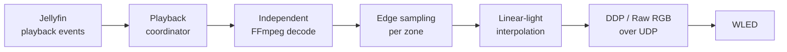

# Jellyfin Realtime Ambilight


*AI-generated concept illustration; actual output depends on your screen, LEDs and room.*

**Turn the wall behind your TV into part of the picture, on hardware you already
own.** Point an LED strip or a set of Philips Hue lights at your Jellyfin library
and the colour on screen spreads onto the room in real time — matched to the
exact frame playing, not a webcam or HDMI capture guessing a few hundred
milliseconds behind.

- **Built for your room, not a demo reel.** A guided calibration wizard walks
  your actual strip through six colour anchors and a white-balance pass, so the
  wall matches the screen on *your* hardware — not a generic factory profile.
- **Two independent outputs, at once if you want.** Drive a [WLED](https://kno.wled.ge)
  LED strip, a Philips Hue Entertainment area, or both together, each tuned
  and calibrated on its own.
- **Never touches your stream.** Runs its own, independent decode on the
  server purely to sample colour — the client's actual playback is never
  captured, delayed or re-encoded because of this plugin.
- **HDR handled on the GPU**, not guessed at: hardware tone-mapping brings
  HDR10/Dolby Vision content down to LED-friendly colour without crushing
  highlights or blowing out whites.
- **Free, open source, self-hosted.** Nothing leaves your server; no cloud
  account, subscription or companion app required.

> **Status: pre-alpha.** The live pipeline works end to end on the developer's
> host, but this has been verified on exactly one Jellyfin server, one WLED
> controller and one Hue bridge. Build and packaging scripts are available —
> see [Installing](#installing). Compatibility beyond this setup is not
> established; read on before you commit an evening to it.

## Vibe coding disclosure

This is an experimental, AI-assisted hobby project developed with coding agents,
including Claude and Codex. Generated code and documentation can contain bugs,
incorrect assumptions and incomplete edge-case handling. Passing unit tests and
working on the developer's hardware do not establish reliability on your setup.

Use at your own risk. Back up your Jellyfin configuration before installing and
keep your LED power supply, wiring and WLED current limits appropriate for your
hardware. The software is provided without warranty under the terms of the
[GPL](LICENSE). Bug reports and human code review are welcome; include versions,
reproduction steps and redacted logs, never API keys or credentials.

This is an independent community project, with no affiliation with or endorsement
from Jellyfin, WLED or Philips/TP Vision.

## How it works



Jellyfin reports what is playing and where the user is in it. The plugin opens
its own FFmpeg decode of that same source, scaled down to a small analysis frame
(160 × 90 by default), samples the edge zones, interpolates them across the
physical LED strip in linear light, and streams RGB24 frames to WLED.

Because the analysis is a second, independent decode, the client's playback is
not modified. Frames are scheduled against Jellyfin's playback clock; a
configurable output delay compensates for the television's display pipeline.
The extra decode consumes server CPU/GPU resources and can compete with playback
on a busy host.

## Requirements

| | |
|---|---|
| Jellyfin | **10.11.9** (the only version this has been run against) |
| Build tools | .NET 9 SDK; Bash and Python 3 for packaging |
| Analysis | Server-readable media and an FFmpeg installation compatible with the plugin's decode/filter path |
| WLED | tested against firmware **16.0.1** |
| Network | the server must reach WLED over UDP; mDNS for auto-discovery |

## Installing

### Via the plugin repository (recommended)

Add this URL under **Dashboard → Plugins → Repositories**:

```
https://raw.githubusercontent.com/cappie15/jellyfin-ambilight-realtime/main/manifest.json
```

Then install **Realtime Ambilight** from the catalog and restart Jellyfin. This
one URL always resolves to the file committed at the repository root on `main`,
so adding it once is enough -- every future release updates that same file
(see "Cutting a release" below), rather than requiring the URL to be re-added
each time. The manifest lists every published version, newest first, so
Jellyfin can also offer a downgrade if a release turns out to have a problem.

### Build from source

Installation from a checkout is manual. For a conventional Linux Jellyfin
service, build and copy **both** assemblies. Adjust the path and service
account for your installation; the install/restart commands require
administrator privileges. Container installations need their own mounted
plugin path and container restart instead.

Back up your existing plugin/configuration before replacing it. From the
repository root:

```sh
dotnet build src/Jellyfin.Plugin.RealtimeAmbilight/Jellyfin.Plugin.RealtimeAmbilight.csproj \
  --configuration Release --no-incremental

sudo install -d -o jellyfin -g jellyfin \
  "/var/lib/jellyfin/plugins/Realtime Ambilight_0.2.0/"

sudo install -o jellyfin -g jellyfin \
  src/Jellyfin.Plugin.RealtimeAmbilight/bin/Release/net9.0/Jellyfin.Plugin.RealtimeAmbilight.dll \
  src/Jellyfin.Plugin.RealtimeAmbilight/bin/Release/net9.0/Jellyfin.Plugin.RealtimeAmbilight.Core.dll \
  "/var/lib/jellyfin/plugins/Realtime Ambilight_0.2.0/"

sudo systemctl restart jellyfin
```

Copying only the plugin assembly and leaving a stale `*.Core.dll` behind causes a
`MissingMethodException` at startup. Always deploy the pair.

### Build an installable archive

```sh
./build/package.sh
```

This recreates `artifacts/` and produces a versioned ZIP (e.g.
`realtime-ambilight_0.2.0.zip`) containing both assemblies and `meta.json`,
plus a `manifest.json` whose default download URL points at a matching
versioned GitHub release -- it only resolves once that ZIP has actually been
published there. Pass your own release base URL as the script's first
argument when hosting elsewhere.

The [CI workflow](.github/workflows/ci.yml) builds, tests and packages the project,
then uploads the ZIP and manifest as the `realtime-ambilight-plugin` artifact --
that CI artifact is a build check, not a publish step; it still has to be
attached to a GitHub release by hand (see below) to actually become installable.

### Cutting a release

1. Bump `version` (and `timestamp`) in `plugin-package/meta.json`.
2. Run `./build/package.sh`; it writes `artifacts/realtime-ambilight_<version>.zip`,
   `artifacts/ambilight-logo.png` and `artifacts/manifest.json`.
3. Fill in that version's `changelog` in `artifacts/manifest.json`, and copy the
   *previous* release's own version entry into the same `versions` array (newest
   first) -- the published manifest is the full, standing history of installable
   versions, not just the newest one.
4. Tag (`git tag vX.Y.Z`, `git push origin vX.Y.Z`) and create a GitHub release
   from that tag, uploading the ZIP, icon and manifest as release assets.
5. Copy the same (multi-version) `artifacts/manifest.json` to `manifest.json` at
   the repository root and commit it to `main` -- this is what the stable
   `raw.githubusercontent.com/.../main/manifest.json` URL above actually serves,
   so a release is not visible to existing repository subscribers until this
   step lands on `main`.
Packaging implementation: [build/package.sh](build/package.sh).

## Configuration

Everything is configured from the plugin's own page in the Jellyfin dashboard.
Each field carries its own explanation and names its default.

| Setting | Default | Notes |
|---|---|---|
| Playback device | *not bound* | Binds one Jellyfin device to this installation. Unbound means every device drives the LEDs. |
| WLED controller | `10.0.0.8`, HTTP port 80 | Developer defaults: select your own controller with mDNS discovery or manual entry. |
| Realtime protocol | Auto | Raw RGB up to 490 LEDs, DDP above it. |
| LED delay | 0 ms | Raise only when the LEDs visibly run ahead of the picture. |
| LED updates / analysis | 30 fps | Analysing faster than the output rate gains nothing. |
| Hold while paused | on | Holds the last colours; keepalive frames are sent every second. Off releases via WLED's timeout. |
| Stop fade | 250 ms | Fades to black before transmission ceases. |
| LED counts | 265 / 150 / 266 / 150 | Clockwise from the top-left corner. |
| Analysis width | 160 px | Height follows from 16:9, so 160 × 90. |
| Sampling depth | 10% | Samples inward from each active-picture edge. |
| Ignore black borders | on | Detects letterbox/pillarbox bars before sampling. |
| Brightness | 100% (1-200%) | Global colour control, plus per-side trims. Above 100% pushes already-dim scenes brighter than the source picture — physical LEDs next to a bright HDR screen otherwise always read as dim, since nothing else in the pipeline can push a pixel brighter than it already is. |
| Saturation / RGB gains | 100% | Global colour controls, with additional per-side trims. |
| WLED smoothing | 0 ms (off) | Eases each physical LED toward a newly sampled colour instead of snapping to it. Off by default; raise it only if colour visibly "steps" at low brightness. |
| Send a real white signal (RGBW) | off | Uses the strip's own white LED for grey/white content instead of mixing it from red, green and blue. See [RGBW strips](#rgbw-strips-send-a-real-white-signal) below. |
| Wall colour | white | White leaves wall compensation neutral. |
| Automatic LED gamma detection | on | Reads WLED settings at startup; falls back to the manual correction setting. |

Select your playback device and controller, set the actual LED counts, save and
restart Jellyfin before the first playback test. The default 831-LED layout is
specific to the developer's installation.

Structural settings — WLED endpoint, protocol, LED counts, output FPS, sampling
depth and gamma detection — are read when the output service starts, so
**restart Jellyfin** after changing them. Restart after analysis-setting changes
as well. Delay, enable, hold while paused, fade, colour tuning and black-border
handling take effect during operation.

### Room calibration

The settings page is organised into five tabs -- **TV**, **WLED**, **Ambilight**,
**Advanced** and **Hue** -- so the sliders that matter for calibration are not
mixed in with connection and performance settings. The **Ambilight** tab has a
short flow for the things that differ between installations: overall level, the
wall behind the television, and each side on its own.

Global brightness, colour intensity and a **black level floor** live at the
top: a picture edge darker than the floor drives that LED fully off instead of
a dim, often colour-cast glow, rather than every dark scene keeping a faint
wash of light around the whole room.

Pick the wall's paint colour from a list of soft, contemporary interior
tones -- warm off-whites, greiges, dusty sage and blue, muted clay -- the kind
of colour actually behind a TV today, not swatches sampled evenly across the
full colour wheel; choose "Custom…" for the exact colour with a picker. The
plugin applies a bounded inverse reflectance correction, so it adds back a
little of the primary the wall absorbs most. It cannot make a very dark wall
reflect light it does not have.

The precise pass walks six primary/secondary colours -- red, yellow, green,
cyan, blue, magenta -- each against a plain, solid colour swatch rather than
a photo, with three sliders per colour: a **hue** nudge (how far this colour
actually sits from where the strip should show it, e.g. "a touch pinker"),
its own **brightness**, and its own **intensity**. Those six calibrated
points build one smooth correction curve around the whole colour wheel --
shown back to the operator as an actual chart once the wizard finishes, not
just numbers -- so a colour between two calibrated points is corrected
smoothly too, not just the six points themselves. White keeps its own,
separate colour-temperature control (warmer/cooler). Once the seven swatch
steps are done, check the result against real content the same way you would
watch anything else: play a video in Jellyfin as usual, with the always-on
**Live tuning** panel open, and adjust brightness, smoothing or responsivity
there while it plays.

Click **Start calibration** on the **Ambilight** tab first -- the TV link is
only reachable while a calibration is actually running. On an internet-facing
Jellyfin an always-on, unauthenticated page is its own exposure however
little it can do, so the whole TV-facing surface answers as if it did not
exist until Start is pressed, and again the moment the wizard finishes or
**Stop & release LEDs** is clicked. Open the short link **once**, full-screen,
in the TV's own browser -- it is deliberately as short as an address can be,
because a remote control types it one arrow key at a time, and it is always
plain `http://`: typed bare, some TV browsers guess `https://` first, which
fails with no certificate on a local address. The TV page polls the plugin
every 1.5 s and shows a small "Continue on your phone" hint throughout; on the
last step, the settings page's button becomes **"Done — finish calibration"**,
and the TV shows a clear finished screen once pressed.

Every step, White included, shows one of the operator's own curated photos --
cropped to 16:9 and resized to 1080p, embedded in the plugin itself so
nothing is fetched from the internet and every photo loads instantly -- shown
**full-screen**, never a flat colour swatch. Its own edges are sampled by
exactly the same code path real Jellyfin playback uses (the browser draws the
photo to a canvas, downsizes it, and the plugin runs it through the ordinary
edge-sampling and colour pipeline), so a single well-chosen photo can carry
useful colour at more than one edge at once -- a forest-and-sky photo tunes
green at the bottom and blue at the top together. Sampling itself now weighs
the picture's true outer edge more heavily than the inner edge of the
sampled band, on a linear ramp, so the reading reflects what is actually at
the border rather than being pulled toward the band's more central content.
One continuous LED strip usually runs the whole way round a TV, so the
wizard tunes brightness, saturation and white balance for **all four sides
at once**, not one side at a time; a separate, explicitly optional
"fine-tune each side" section still exists below it for the rare strip that
genuinely needs it.

Every slider updates the LEDs live as you drag it -- no Save, no round trip
-- and each one has small **&minus;/+** buttons beside it, in a proper row
even on a phone, so a step can be repeated by tapping the same spot while
watching the TV instead of the phone. The preview never writes WLED
configuration, and real playback always takes priority over it.

Three related settings live in **Advanced**, deliberately outside the wizard,
because they shape ordinary playback rather than the calibration photos
themselves: **Sampling resolution** (unchanged, and not derived from the
wizard's photos -- a lower analysis size stays the right choice for a
resource-constrained host regardless of how the calibration looks),
**Minimum colour hold**, which holds a physical LED at its last colour
until a newly sampled colour has persisted in the picture for at least that
long (off by default; raise it only if fast cuts or flashes make the strip
feel twitchy, since it trades a little responsiveness for steadiness), and
**Smoothing**, which eases each physical LED toward a newly sampled colour
over a configurable time instead of jumping straight to it -- lower is more
reactive, higher lets colour flow more smoothly at the cost of a real cut or
fast pan taking a little longer to catch up. Off by default (0 ms); see
[ADR-012](docs/architecture/adr/ADR-012-wled-temporal-smoothing.md) for what
was actually measured before building it.

Output is temporally dithered: WLED drives its LEDs straight from the byte
value, and linear light gives the darkest tones the fewest of the 256
available steps even though the eye resolves the most detail there, which
otherwise reads as visible "steps" on a slow fade to black. The encoder carries
each channel's rounding error into the next frame instead of discarding it, so
the strip alternates between two adjacent byte values in the right proportion
-- far above flicker fusion at any output rate this plugin uses -- instead of
holding one brightness for several frames and then jumping to the next.

### RGBW strips (send a real white signal)

Some strips have a fourth, dedicated white LED alongside red, green and blue.
Turning on **Send a real white signal (RGBW)** sends grey/white content to
that channel instead of mixing it from red, green and blue — less current
draw and a more neutral white, on a strip that actually has the fourth die.
Off by default, since not every strip does; restart Jellyfin after changing
it, like the other WLED connection settings.

A single white die cannot reach the combined peak brightness of red, green
and blue lit together, confirmed live via flicker photometry (alternating
the same physical LEDs between a mixed-RGB white and the white channel alone
at ~12.5 Hz, which cancels the two's considerable difference in colour
temperature and isolates a genuine brightness gap): the gap held completely
flat between white values of 100 and 230 out of 255, so no drive value closes
it. **White LED strength** (default 50%) caps how much of a bright/near-white
pixel's shared grey is allowed onto the white die before the rest stays on
red, green and blue instead — those three, lit together, can reach brightness
the one white die cannot. Dim greys are unaffected either way, since the
die's own peak was never the limiting factor for them. Lower this further if
white content still looks dim on your strip; every RGBW die is different, and
50% is a reasoned starting point, not a universal constant.

### Controlling WLED from the plugin

The **WLED** tab is read-only by default: the plugin only ever reads WLED's
configuration to show its status and warn about settings that fight the
Ambilight. Checking **"Allow this plugin to fix WLED settings"** lets it also
turn off WLED's "force max brightness" for realtime data with one click,
instead of requiring a separate login to WLED's own interface. This is the
only WLED setting the plugin can write, and the request never names the ABL
power budget (`maxpwr`) or anything else -- that value is only ever displayed,
never changed by this plugin.

### Philips Hue Entertainment (optional)

The **Hue** tab adds Hue lights as a second, fully independent realtime output
alongside WLED, following the same picture on the same bound TV. Off by
default, and harmless when off -- nothing about WLED changes. Version 1
supports one paired bridge and one existing entertainment area (created and
edited only in the Hue app, never by this plugin); the square Bridge and
Bridge Pro are supported, the original round Bridge v1 is not, since it has
no Entertainment API at all. Entertainment streaming changes a light's
colour but never its power state, so a light that is off when playback
starts is turned on first — otherwise it would stay dark for the whole
session regardless of what is streamed to it; a light the session found off
is turned back off again once playback ends. See
[`docs/architecture/adr/ADR-011-hue-entertainment-integration.md`](docs/architecture/adr/ADR-011-hue-entertainment-integration.md)
for the full design, transport choice, and known limitations.

### Transports

| Protocol | Port | Limit |
|---|---|---|
| Hyperion Raw RGB | 19446 | one datagram, ≤ 490 LEDs |
| DDP | 4048 | multi-packet, PUSH on the final packet only |

## What it will not do to your WLED

This matters when a controller is driving several hundred LEDs on a real power
supply, so it is enforced rather than merely intended:

- **No persistent WLED configuration is ever written.** The plugin contains no
  WLED control-plane writer at all — only realtime UDP frames and the read-only
  `/json/info` endpoint used to confirm a discovered controller and
  `/json/cfg` used to read gamma/brightness settings.
- **Current limits are never touched.** `maxpwr` and the brightness limiter stay
  exactly as configured on the device.
- **Control is returned by ceasing transmission.** WLED's own realtime timeout
  (2.5 s on the reference controller) restores its previous effect. Measurements
  behind that choice are in
  [ADR-004](docs/architecture/adr/ADR-004-wled-realtime-protocol-strategy.md).
- **Discovery is read-only** and restricted to administrators.

## Known limitations and troubleshooting

- **Media and HDR:** local-media playback is the implemented path. SDR and one
  HDR10 setup have been observed working; HLG and Dolby Vision need separate
  visual validation. Source-profile detection and hardware-path selection are
  incomplete, so this is not a general HDR compatibility claim.
- **Timing:** the SDR analysis decode now uses VAAPI hardware acceleration
  when the configured device path exists on disk (falling back to software
  otherwise), matching the HDR path's own long-standing VAAPI graph. Measured
  on the reference host against a 4K HEVC source: software SDR decode ran at
  184% CPU and 0.3× realtime; VAAPI ran at 68% CPU and 15× realtime. This was
  the actual cause of the analysis decoder repeatedly losing its lead and
  restarting during a real test — not a regression in colour processing,
  which costs negligible CPU by comparison. A host with no VAAPI device node,
  the wrong driver, or missing permissions can still fall behind; start with
  0 ms delay and increase only if the LEDs visibly lead the picture.
- **No light:** check the enable switch, bound device, controller address and
  server-to-controller UDP access. Inspect Jellyfin logs for `playback start
  received`, `resolved source`, `processed its first decoded frame` and
  `sent its first WLED frame` to locate the failing stage.
- **Too bright or washed out:** check the Brightness control (1-200%, see
  Configuration above) and the settings page's WLED brightness warning. On an
  RGBW strip, also check **White LED strength** — content on the white channel
  has a lower physical ceiling than red, green and blue combined, so a value
  too high there can look dim rather than too bright. Gamma detection happens
  at startup; restart Jellyfin after changing WLED's gamma configuration. The
  plugin does not change it.
- **Old settings page or startup errors:** rebuild the plugin explicitly with
  `--no-incremental`, deploy both DLLs together and restart Jellyfin.
- **Controller outages:** richer recovery/retry handling and automated hardware
  integration tests are still outstanding.

## Development

```sh
dotnet build Jellyfin.RealtimeAmbilight.sln --configuration Release --no-incremental
dotnet test Jellyfin.RealtimeAmbilight.sln --configuration Release --no-build
```

Build the whole solution: the test project references Core only, so running tests
alone does not validate the plugin assembly or its embedded settings page.

The unit tests cover the boundaries where a silent mistake would be expensive:
transports that must never truncate a frame, clockwise layout and linear-light
interpolation, playback coordination and the latest-frame handoff, SDR and HDR
FFmpeg argument construction, sampling, and the mDNS parser — the last verified
against a real 192-byte packet captured from a WLED controller, including every
truncation of it and a forged compression-pointer loop.

The project is deliberately split so that everything decidable is testable
without Jellyfin:

| Project | Contains |
|---|---|
| `Jellyfin.Plugin.RealtimeAmbilight.Core` | Pure logic: protocols, sampling, layout, colour, discovery parsing |
| `Jellyfin.Plugin.RealtimeAmbilight` | Jellyfin surface: plugin, config page, hosted services, API |

Architecture decisions and the measured research behind them live in
[docs/architecture/adr](docs/architecture/adr/). They record what was actually
measured against real hardware, including the corrections — several decisions
here reversed an earlier assumption once it was tested. The current project
handover is [docs/handoff/CURRENT.md](docs/handoff/CURRENT.md).

## License

GPL-3.0-or-later. See [LICENSE](LICENSE).
