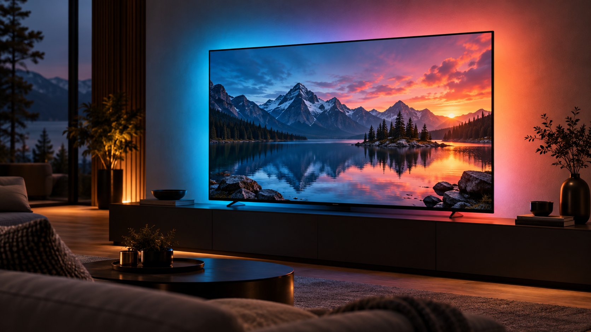
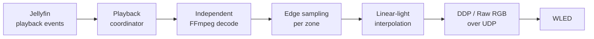

# Jellyfin Realtime Ambilight



*AI-generated concept illustration; actual output depends on your screen, LEDs and room.*

Server-side realtime Ambilight for Jellyfin, driving a [WLED](https://kno.wled.ge)
controller over DDP or Hyperion Raw RGB.

The plugin analyses the **original media stream on the server**, in a decode pass
of its own. It never captures a client display, never re-encodes the video the
client is watching, and does not intentionally delay playback. When playback stops it simply
stops transmitting, and WLED returns to whatever it was doing before.

> **Status: pre-alpha.** The live pipeline works end to end on the developer's
> host, but this has been verified on exactly one Jellyfin server and one WLED
> controller. Build and packaging scripts are available — see [Installing](#installing).
> Compatibility beyond this setup is not established.

## Vibe coding disclosure

This is an experimental, AI-assisted hobby project developed with coding agents,
including Claude and Codex. Generated code and documentation can contain bugs,
incorrect assumptions and incomplete edge-case handling. Passing unit tests and
working on the developer's hardware do not establish reliability on your setup.

Use at your own risk. Back up your Jellyfin configuration before installing and
keep your LED power supply, wiring and WLED current limits appropriate for your
hardware. The software is provided without warranty under the terms of the
[GPL](LICENSE). Bug reports and human code review are welcome; include versions,
reproduction steps and redacted logs, never API keys or credentials.

This is an independent community project, with no affiliation with or endorsement
from Jellyfin, WLED or Philips/TP Vision.

## How it works



Jellyfin reports what is playing and where the user is in it. The plugin opens
its own FFmpeg decode of that same source, scaled down to a small analysis frame
(160 × 90 by default), samples the edge zones, interpolates them across the
physical LED strip in linear light, and streams RGB24 frames to WLED.

Because the analysis is a second, independent decode, the client's playback is
not modified. Frames are scheduled against Jellyfin's playback clock; a
configurable output delay compensates for the television's display pipeline.
The extra decode consumes server CPU/GPU resources and can compete with playback
on a busy host.

## Requirements

| | |
|---|---|
| Jellyfin | **10.11.9** (the only version this has been run against) |
| Build tools | .NET 9 SDK; Bash and Python 3 for packaging |
| Analysis | Server-readable media and an FFmpeg installation compatible with the plugin's decode/filter path |
| WLED | tested against firmware **16.0.1** |
| Network | the server must reach WLED over UDP; mDNS for auto-discovery |

## Installing

Installation from this checkout is manual. The package script generates a ZIP
and repository manifest; generating them does **not** publish a release or host
a plugin repository.

For a conventional Linux Jellyfin service, build and copy **both** assemblies.
Adjust the path and service account for your installation; the install/restart
commands require administrator privileges. Container installations need their
own mounted plugin path and container restart instead.

Back up your existing plugin/configuration before replacing it. From the
repository root:

```sh
dotnet build src/Jellyfin.Plugin.RealtimeAmbilight/Jellyfin.Plugin.RealtimeAmbilight.csproj \
  --configuration Release --no-incremental

sudo install -d -o jellyfin -g jellyfin \
  "/var/lib/jellyfin/plugins/Realtime Ambilight_0.1.1/"

sudo install -o jellyfin -g jellyfin \
  src/Jellyfin.Plugin.RealtimeAmbilight/bin/Release/net9.0/Jellyfin.Plugin.RealtimeAmbilight.dll \
  src/Jellyfin.Plugin.RealtimeAmbilight/bin/Release/net9.0/Jellyfin.Plugin.RealtimeAmbilight.Core.dll \
  "/var/lib/jellyfin/plugins/Realtime Ambilight_0.1.1/"

sudo systemctl restart jellyfin
```

Copying only the plugin assembly and leaving a stale `*.Core.dll` behind causes a
`MissingMethodException` at startup. Always deploy the pair.

### Build an installable archive

```sh
./build/package.sh
```

This recreates `artifacts/` and produces `realtime-ambilight_0.1.1.zip` containing
both assemblies and `meta.json`, plus `manifest.json`. The manifest's default
download URL points to a versioned GitHub release; it only works after the ZIP
has been published there. Pass your own release base URL as the script's first
argument when hosting elsewhere.

The [CI workflow](.github/workflows/ci.yml) builds, tests and packages the project,
then uploads the ZIP and manifest as the `realtime-ambilight-plugin` artifact.
Packaging implementation: [build/package.sh](build/package.sh).

## Configuration

Everything is configured from the plugin's own page in the Jellyfin dashboard.
Each field carries its own explanation and names its default.

| Setting | Default | Notes |
|---|---|---|
| Playback device | *not bound* | Binds one Jellyfin device to this installation. Unbound means every device drives the LEDs. |
| WLED controller | `10.0.0.8`, HTTP port 80 | Developer defaults: select your own controller with mDNS discovery or manual entry. |
| Realtime protocol | Auto | Raw RGB up to 490 LEDs, DDP above it. |
| LED delay | 0 ms | Raise only when the LEDs visibly run ahead of the picture. |
| LED updates / analysis | 30 fps | Analysing faster than the output rate gains nothing. |
| Hold while paused | on | Holds the last colours; keepalive frames are sent every second. Off releases via WLED's timeout. |
| Stop fade | 250 ms | Fades to black before transmission ceases. |
| LED counts | 265 / 150 / 266 / 150 | Clockwise from the top-left corner. |
| Analysis width | 160 px | Height follows from 16:9, so 160 × 90. |
| Sampling depth | 10% | Samples inward from each active-picture edge. |
| Ignore black borders | on | Detects letterbox/pillarbox bars before sampling. |
| Brightness / saturation / RGB gains | 100% | Global colour controls, with additional per-side trims. |
| Wall colour | white | White leaves wall compensation neutral. |
| Automatic LED gamma detection | on | Reads WLED settings at startup; falls back to the manual correction setting. |

Select your playback device and controller, set the actual LED counts, save and
restart Jellyfin before the first playback test. The default 831-LED layout is
specific to the developer's installation.

Structural settings — WLED endpoint, protocol, LED counts, output FPS, sampling
depth and gamma detection — are read when the output service starts, so
**restart Jellyfin** after changing them. Restart after analysis-setting changes
as well. Delay, enable, hold while paused, fade, colour tuning and black-border
handling take effect during operation.

### Room calibration

The settings page is organised into four tabs -- **TV**, **WLED**, **Ambilight**
and **Advanced** -- so the sliders that matter for calibration are not mixed in
with connection and performance settings. The **Ambilight** tab has a short
flow for the things that differ between installations: overall level, the wall
behind the television, and each side on its own.

Global brightness, colour intensity and a **black level floor** live at the
top: a picture edge darker than the floor drives that LED fully off instead of
a dim, often colour-cast glow, rather than every dark scene keeping a faint
wash of light around the whole room.

Pick the wall's paint colour from a list of common presets (or choose
"Custom…" for the exact colour with a picker); the plugin applies a bounded
inverse reflectance correction, so it adds back a little of the primary the
wall absorbs most. It cannot make a very dark wall reflect light it does not
have.

For the precise pass, open **Fine-tune each side**: a seven-step wizard, in
order, white &rarr; blue &rarr; red &rarr; green &rarr; yellow &rarr; purple
&rarr; orange. Copy the single test-pattern link and open it full-screen in
the TV's own browser **once** -- it polls the plugin every 1.5 s and updates
itself as you click **Next**/**Back** on the settings page, so the TV is never
touched again for the rest of the wizard. Choose a side, start the live
preview, and the plugin lights only that physical side through the regular
realtime protocol while the TV shows the matching colour at its edge. Adjust
that side's brightness and RGB trims until the wall glow meets the on-screen
edge, click Next, and repeat; save when done. The preview never writes WLED
configuration, and real playback automatically takes priority over a
forgotten preview.

Every step but white also shows a curated nature photograph centred on the
TV -- never touching the sampled edge band, so it cannot interfere with the
match itself -- credited to its Wallhaven photographer by name with a link
back to their profile and the source page. **Try another photo** cycles
through two or three picks per colour if the first doesn't read clearly on
your wall. White has no photo: a flat plane is what the eye needs to judge a
clean white by, which a photograph can never quite give under camera-specific
white balance.

Output is temporally dithered: WLED drives its LEDs straight from the byte
value, and linear light gives the darkest tones the fewest of the 256
available steps even though the eye resolves the most detail there, which
otherwise reads as visible "steps" on a slow fade to black. The encoder carries
each channel's rounding error into the next frame instead of discarding it, so
the strip alternates between two adjacent byte values in the right proportion
-- far above flicker fusion at any output rate this plugin uses -- instead of
holding one brightness for several frames and then jumping to the next.

### Controlling WLED from the plugin

The **WLED** tab is read-only by default: the plugin only ever reads WLED's
configuration to show its status and warn about settings that fight the
Ambilight. Checking **"Allow this plugin to fix WLED settings"** lets it also
turn off WLED's "force max brightness" for realtime data with one click,
instead of requiring a separate login to WLED's own interface. This is the
only WLED setting the plugin can write, and the request never names the ABL
power budget (`maxpwr`) or anything else -- that value is only ever displayed,
never changed by this plugin.

### Transports

| Protocol | Port | Limit |
|---|---|---|
| Hyperion Raw RGB | 19446 | one datagram, ≤ 490 LEDs |
| DDP | 4048 | multi-packet, PUSH on the final packet only |

## What it will not do to your WLED

This matters when a controller is driving several hundred LEDs on a real power
supply, so it is enforced rather than merely intended:

- **No persistent WLED configuration is ever written.** The plugin contains no
  WLED control-plane writer at all — only realtime UDP frames and the read-only
  `/json/info` endpoint used to confirm a discovered controller and
  `/json/cfg` used to read gamma/brightness settings.
- **Current limits are never touched.** `maxpwr` and the brightness limiter stay
  exactly as configured on the device.
- **Control is returned by ceasing transmission.** WLED's own realtime timeout
  (2.5 s on the reference controller) restores its previous effect. Measurements
  behind that choice are in
  [ADR-004](docs/architecture/adr/ADR-004-wled-realtime-protocol-strategy.md).
- **Discovery is read-only** and restricted to administrators.

## Known limitations and troubleshooting

- **Media and HDR:** local-media playback is the implemented path. SDR and one
  HDR10 setup have been observed working; HLG and Dolby Vision need separate
  visual validation. Source-profile detection and hardware-path selection are
  incomplete, so this is not a general HDR compatibility claim.
- **Timing:** analysis can lose its lead during playback. Resynchronisation
  limits the impact, but the underlying cause remains under investigation.
  Start with 0 ms delay and increase only if the LEDs visibly lead the picture.
- **No light:** check the enable switch, bound device, controller address and
  server-to-controller UDP access. Inspect Jellyfin logs for `playback start
  received`, `resolved source`, `processed its first decoded frame` and
  `sent its first WLED frame` to locate the failing stage.
- **Too bright or washed out:** check colour controls and the settings page's
  WLED brightness warning. Gamma detection happens at startup; restart Jellyfin
  after changing WLED's gamma configuration. The plugin does not change it.
- **Old settings page or startup errors:** rebuild the plugin explicitly with
  `--no-incremental`, deploy both DLLs together and restart Jellyfin.
- **Controller outages:** richer recovery/retry handling and automated hardware
  integration tests are still outstanding.

## Development

```sh
dotnet build Jellyfin.RealtimeAmbilight.sln --configuration Release --no-incremental
dotnet test Jellyfin.RealtimeAmbilight.sln --configuration Release --no-build
```

Build the whole solution: the test project references Core only, so running tests
alone does not validate the plugin assembly or its embedded settings page.

The unit tests cover the boundaries where a silent mistake would be expensive:
transports that must never truncate a frame, clockwise layout and linear-light
interpolation, playback coordination and the latest-frame handoff, SDR and HDR
FFmpeg argument construction, sampling, and the mDNS parser — the last verified
against a real 192-byte packet captured from a WLED controller, including every
truncation of it and a forged compression-pointer loop.

The project is deliberately split so that everything decidable is testable
without Jellyfin:

| Project | Contains |
|---|---|
| `Jellyfin.Plugin.RealtimeAmbilight.Core` | Pure logic: protocols, sampling, layout, colour, discovery parsing |
| `Jellyfin.Plugin.RealtimeAmbilight` | Jellyfin surface: plugin, config page, hosted services, API |

Architecture decisions and the measured research behind them live in
[docs/architecture/adr](docs/architecture/adr/). They record what was actually
measured against real hardware, including the corrections — several decisions
here reversed an earlier assumption once it was tested. The current project
handover is [docs/handoff/CURRENT.md](docs/handoff/CURRENT.md).

## License

GPL-3.0-or-later. See [LICENSE](LICENSE).
