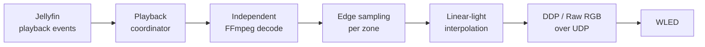

# Jellyfin Realtime Ambilight

Server-side realtime Ambilight for Jellyfin, driving a [WLED](https://kno.wled.ge)
controller over DDP or Hyperion Raw RGB.

The plugin analyses the **original media stream on the server**, in a decode pass
of its own. It never captures a client display, never re-encodes the video the
client is watching, and never delays playback. When playback stops it simply
stops transmitting, and WLED returns to whatever it was doing before.

> **Status: pre-alpha.** The live pipeline works end to end on the developer's
> host, but this has been verified on exactly one Jellyfin server and one WLED
> controller. There is no release package yet — see [Installing](#installing).

---

## How it works



Jellyfin reports what is playing and where the user is in it. The plugin opens
its own FFmpeg decode of that same source, scaled down to a small analysis frame
(160 × 90 by default), samples the edge zones, interpolates them across the
physical LED strip in linear light, and streams RGB24 frames to WLED.

Because the analysis is a second, independent decode, the client's playback is
never touched — the trade-off is that the LEDs must be aligned to the client's
display pipeline with a configurable output delay.

## Requirements

| | |
|---|---|
| Jellyfin | **10.11.9** (the only version this has been run against) |
| Runtime | .NET 9 |
| WLED | tested against firmware **16.0.1** |
| Network | the server must reach WLED over UDP; mDNS for auto-discovery |

## Installing

There is no plugin repository manifest yet, so installation is manual. Build the
solution and copy **both** assemblies into a plugin directory on the server:

```sh
dotnet build Jellyfin.RealtimeAmbilight.sln --configuration Release

install -o jellyfin -g jellyfin \
  src/Jellyfin.Plugin.RealtimeAmbilight/bin/Release/net9.0/Jellyfin.Plugin.RealtimeAmbilight.dll \
  src/Jellyfin.Plugin.RealtimeAmbilight/bin/Release/net9.0/Jellyfin.Plugin.RealtimeAmbilight.Core.dll \
  "/var/lib/jellyfin/plugins/Realtime Ambilight_0.1.1/"

systemctl restart jellyfin
```

Copying only the plugin assembly and leaving a stale `*.Core.dll` behind causes a
`MissingMethodException` at startup. Always deploy the pair.

## Configuration

Everything is configured from the plugin's own page in the Jellyfin dashboard.
Each field carries its own explanation and names its default.

| Setting | Default | Notes |
|---|---|---|
| Playback device | *not bound* | Binds one Jellyfin device to this installation. Unbound means every device drives the LEDs. |
| WLED controller | auto-discovered | Found over mDNS; manual host/port entry appears when the scan finds nothing. |
| Realtime protocol | Auto | Raw RGB up to 490 LEDs, DDP above it. |
| LED delay | 0 ms | Raise only when the LEDs visibly run ahead of the picture. |
| LED updates / analysis | 30 fps | Analysing faster than the output rate gains nothing. |
| Pause keepalive | 2 s | Holds the last colours while paused. |
| Stop fade | 250 ms | Fades to black before transmission ceases. |
| LED counts | 265 / 150 / 266 / 150 | Clockwise from the top-left corner. |
| Analysis width | 160 px | Height follows from 16:9, so 160 × 90. |

Structural settings — WLED endpoint, protocol, LED counts and output FPS — are
read when the output service starts, so **restart Jellyfin** after changing them.
Delay, enable, keepalive and fade take effect immediately.

### Transports

| Protocol | Port | Limit |
|---|---|---|
| Hyperion Raw RGB | 19446 | one datagram, ≤ 490 LEDs |
| DDP | 4048 | multi-packet, PUSH on the final packet only |

## What it will not do to your WLED

This matters when a controller is driving several hundred LEDs on a real power
supply, so it is enforced rather than merely intended:

- **No persistent WLED configuration is ever written.** The plugin contains no
  WLED control-plane writer at all — only realtime UDP frames and the read-only
  `/json/info` endpoint used to confirm a discovered controller.
- **Current limits are never touched.** `maxpwr` and the brightness limiter stay
  exactly as configured on the device.
- **Control is returned by ceasing transmission.** WLED's own realtime timeout
  (2.5 s on the reference controller) restores its previous effect. Measurements
  behind that choice are in
  [ADR-004](docs/architecture/adr/ADR-004-wled-realtime-protocol-strategy.md).
- **Discovery is read-only** and restricted to administrators.

## Development

```sh
dotnet test Jellyfin.RealtimeAmbilight.sln --configuration Release
```

53 tests cover the boundaries where a silent mistake would be expensive:
transports that must never truncate a frame, clockwise layout and linear-light
interpolation, playback coordination and the latest-frame handoff, SDR and HDR
FFmpeg argument construction, sampling, and the mDNS parser — the last verified
against a real 192-byte packet captured from a WLED controller, including every
truncation of it and a forged compression-pointer loop.

The project is deliberately split so that everything decidable is testable
without Jellyfin:

| Project | Contains |
|---|---|
| `Jellyfin.Plugin.RealtimeAmbilight.Core` | Pure logic: protocols, sampling, layout, colour, discovery parsing |
| `Jellyfin.Plugin.RealtimeAmbilight` | Jellyfin surface: plugin, config page, hosted services, API |

Architecture decisions and the measured research behind them live in
[docs/architecture/adr](docs/architecture/adr/). They record what was actually
measured against real hardware, including the corrections — several decisions
here reversed an earlier assumption once it was tested. The current project
handover is [docs/handoff/CURRENT.md](docs/handoff/CURRENT.md).

## License

GPL-3.0-or-later. See [LICENSE](LICENSE).
